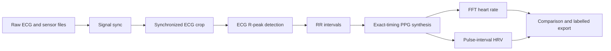

# Synthetic PPG Generation and Derived Metrics

## Purpose and document status

This document is the canonical technical description of the synthetic
photoplethysmography (PPG) stage in the Video Research Tool. It is intended to
support software maintenance, reproducibility, and preparation of a scientific
paper. It describes the implementation as of **2026-09-25**.

The implementation is in:

- `app/synthetic_ppg.py`: ECG peak detection, PPG synthesis, HR, and HRV.
- `app/modes/mode3_synthetic_ppg.py`: GUI workflow, reference selection,
  persistence, comparison, and output organization.
- `app/state.py`: project and metadata-sidecar persistence.
- `tests/test_synthetic_ppg.py` and `tests/test_synthetic_ppg_widget.py`:
  behavioral regression tests.

This document distinguishes the implemented method from development-set
observations. The validation example below is not an independent clinical
validation and must not be reported as one.

## Workflow position and data boundary

Synthetic PPG generation is an optional workflow stage between Signal sync and
Labelling:

Only the synchronized ECG selected in the GUI is used. The stage does not
reload the original, longer ECG and does not search for peaks before or after
the synchronized interval. Consequently:

- the first PPG timestamp is the first R peak detected in the synchronized ECG;
- the final PPG sample precedes the last detected R peak by one PPG sample;
- no waveform is synthesized before the first or after the last detected peak;
- edge behavior is explicit and reproducible, but the PPG does not cover ECG
  samples outside the first-to-last detected-peak span.

All internal and exported timestamps are timezone-aware UTC timestamps.

## Default parameters

| Component | Parameter | Default |
|---|---|---:|
| ECG detector | Butterworth order | 3 |
| ECG detector | Band-pass | 5-25 Hz |
| ECG detector | Minimum peak distance | 0.35 s |
| ECG detector | Prominence multiplier | 4.0 |
| PPG synthesis | Sampling frequency | 125 Hz |
| PPG model | Gaussian phase locations | -1.6184, 0.8903 rad |
| PPG model | Gaussian amplitudes | 0.7482, 0.0444 |
| PPG model | Gaussian widths | 0.9353, 1.9499 rad |
| HR | Window duration | 10 s |
| HR | Default update interval | 1 s |
| HR | Band-pass/search band | 0.6-3.3 Hz (36-198 BPM) |
| HR | Base detrending parameter | 100 at 30 Hz |
| HRV pulse detector | Minimum peak distance | 0.3 s |
| HRV pulse detector | Prominence | 5% of PPG range |
| HRV artifact filter | Accepted interval | 300-2000 ms |
| HRV artifact filter | Local median width | 11 intervals |
| HRV artifact filter | Accepted local ratio | 0.6-1.6 |
| HRV | Window length | 30-300 accepted intervals (expanding, then rolling) |
| HRV | Update interval | 1 s |

ECG detection and PPG sampling parameters are editable in the GUI. The current
HR and HRV analysis settings are implementation constants.

## ECG R-peak detection

The synchronized ECG CSV must contain `timestamp_utc` and `ecg_waveform` (the
internal API also accepts `value`). Invalid values and duplicate timestamps are
removed, and samples are sorted in time. ECG sampling frequency is inferred
from the median positive timestamp difference:

$$
f_{s,ECG} = \frac{1}{\operatorname{median}(t_i-t_{i-1})}.
$$

A third-order Butterworth 5-25 Hz band-pass is applied with zero-phase
second-order-section filtering (`sosfiltfilt`). Let $x_f$ be the filtered ECG.
The robust scale is the unnormalized median absolute deviation:

$$
s_{MAD}=\operatorname{median}\left(\left|x_f-
\operatorname{median}(x_f)\right|\right).
$$

SciPy `find_peaks` detects positive peaks with a minimum separation of 0.35 s
and minimum prominence $4s_{MAD}$. RR intervals are timestamp differences
between consecutive detected peaks:

$$
RR_i = t_i-t_{i-1}.
$$

The first detected peak has no preceding RR interval. The detector does not
currently perform polarity inversion, template matching, manual peak editing,
or ECG-specific ectopic-beat classification. Peak quality should therefore be
reviewed for each acquisition protocol.

## Exact-timing synthetic PPG model

The waveform model is adapted from PPGSynth by Tang et al. The state is
$(x,y,z)$, where $(x,y)$ follows a phase trajectory and $z$ is the PPG
amplitude. For the active RR interval $RR_i$:

$$
\omega_i = \frac{2\pi}{RR_i},
$$

$$
\frac{dx}{dt}=-\omega_i y, \qquad
\frac{dy}{dt}=\omega_i x.
$$

The phase is $\theta=\operatorname{atan2}(y,x)$. With two Gaussian extrema,
the implemented amplitude derivative is:

$$
\frac{dz}{dt}=-\frac{d\theta}{dt}
\sum_{j=1}^{2}
\frac{a_j(\theta-\theta_j)}{2}
\exp\left[-\left(\frac{\theta-\theta_j}{b_j}\right)^2\right].
$$

The initial state is $(-1,0,0)$. SciPy `solve_ivp` integrates the system with
RK45 at requested output times. The generated $z$ trajectory is min-max
normalized to $[0,1]$.

### Exact cumulative RR boundaries

The upstream MATLAB-compatible implementation repeats every RR value for
`ceil(fs * RR)` samples. Independent rounding introduces a small positive timing
error at nearly every beat and therefore cumulative drift. This integration
instead changes the active RR interval at its exact cumulative boundary:

$$
B_i=\sum_{k=1}^{i}RR_k.
$$

At solver time $t$, the active interval is the first $i$ for which $B_i>t$.
The output duration is $\sum_i RR_i$ and the sample count is
$\lceil f_s\sum_i RR_i\rceil$. This choice preserves the measured cumulative
beat timing and was made specifically to avoid long-recording time dilation.

## Heart-rate estimation

Heart rate is not calculated as $60/RR$ from detected PPG peaks. That earlier
approach was sensitive to secondary waveform extrema and produced false
high-rate spikes. HR is now estimated from overlapping 10-second PPG windows
using an rPPG-Toolbox-style spectral pipeline.

### Preprocessing

Each window is detrended with the smoothness-prior method. If $D_2$ is the
second-difference matrix, the estimated trend is:

$$
\hat{x}_{trend} = (I+\lambda^2D_2^TD_2)^{-1}x.
$$

The base value $\lambda=100$ is associated with a 30 Hz reference rate and is
scaled for the PPG sampling frequency:

$$
\lambda_{scaled}=100\left(\frac{f_s}{30}\right)^2.
$$

The sparse system is factorized once and reused for every window. Detrended
samples are filtered with a first-order 0.6-3.3 Hz Butterworth band-pass using
zero-phase `filtfilt`.

### Spectrum and sub-bin refinement

The dominant in-band frequency is found from the squared magnitude of the real
FFT. The FFT length is the next power of two at least eight times the window
sample count. This zero-padding gives a denser evaluated frequency grid but
does not add independent information.

To reduce quantized, stair-step BPM values, the selected frequency is refined
with a three-bin log-parabolic estimate. For log powers $L_{-1},L_0,L_{+1}$,
the fractional-bin offset is:

$$
\delta = \frac{1}{2}
\frac{L_{-1}-L_{+1}}{L_{-1}-2L_0+L_{+1}},
\qquad -0.5\leq\delta\leq0.5.
$$

The refined frequency is $f=(k+\delta)\Delta f$ and
$HR=60f$ BPM.

### Second-harmonic correction

The two-Gaussian morphology can make the second harmonic stronger than the
fundamental. Two independent guards are applied after dominant-bin selection:
recent-HR continuity and window autocorrelation. Let $HR_m$ be the median of the
previous five accepted estimates. A candidate is treated as a possible second
harmonic by the continuity path when:

$$
1.6HR_m < HR_{candidate} < 2.4HR_m.
$$

The strongest spectral bin in a five-bin neighborhood around half the dominant
frequency is selected as the fundamental candidate. The continuity path uses
that candidate only when its power is at least 20% of the dominant peak power
and its BPM differs from $HR_m$ by no more than 30%.

Continuity alone cannot recover when the first analyzed window is already on the
second harmonic or when a lock persists long enough to redefine the recent
median. Therefore, autocorrelation is calculated from the same FFT power through
the Wiener-Khinchin relation. The positive-lag autocorrelation is divided by the
number of overlapping samples at each lag. The strongest local maximum between
$f_s/3.3$ and $f_s/0.6$ samples is refined parabolically and converted to an
autocorrelation HR, $HR_{ACF}$. The half-frequency candidate is selected when:

$$
1.6HR_{ACF} < HR_{candidate} < 2.4HR_{ACF}
$$

and the half-frequency BPM differs from $HR_{ACF}$ by no more than 30%. This
autocorrelation path does not require the 20% spectral-power threshold because
its purpose is to recover a fundamental that is weak in the amplitude spectrum.
After a history is available, autocorrelation-only correction is applied only
when the dominant candidate differs by more than 10% from the median of the
previous five accepted estimates. This prevents isolated autocorrelation
subharmonics from halving a dominant estimate that is already locally stable.

Neither path uses a fixed upper-HR cutoff or reference HR values. The combined
rule rejects abrupt and sustained $2\times$ harmonic locks, including locks
present from the first window. It can nevertheless suppress a genuine signal
whose dominant frequency is twice an autocorrelation subharmonic and must be
reported as an algorithmic assumption.

### Output timestamps and edge windows

When a synchronized Zephyr HR file exists, its timestamps are used directly;
otherwise the first available synchronized HR source is used. The generated HR
therefore has the same timestamp count as that reference. If no synchronized HR
source exists, windows advance by one second and are timestamped at their
midpoints.

For a requested timestamp near either recording edge, the 10-second window is
shifted to the nearest complete window rather than shortened. Several edge
timestamps can consequently share the same underlying window and value. This
maintains point-count parity but does not create new edge information. Reference
HR values are used only to select output timestamps; their numerical values are
not inputs to PPG HR estimation.

## HRV estimation

HRV is calculated from detected synthetic PPG pulse intervals, not from FFT HR.
PPG peaks are detected with minimum separation 0.3 s and prominence equal to 5%
of the full generated PPG amplitude range. Pulse intervals are accepted when:

$$
300\ \mathrm{ms}\leq IBI_i\leq2000\ \mathrm{ms}
$$

and

$$
0.6\leq\frac{IBI_i}{\operatorname{median}_{11}(IBI)}\leq1.6.
$$

At each one-second output time after at least 30 accepted intervals are
available, SDNN is the sample standard deviation of the most recent
$N=\min(n_{accepted}, 300)$ accepted intervals. The window therefore expands
from 30 to 300 intervals and then rolls. The warm-up exists because the
synthetic PPG starts at the first detected peak of the synchronized ECG crop:
a short recording (for example, a 175 s baseline with about 200 beats) never
reaches 300 intervals, whereas Zephyr has beat history from before the crop.
The `accepted_intervals` column records $N$ for every estimate:

$$
SDNN=\sqrt{\frac{1}{N-1}\sum_{i=1}^{N}(IBI_i-\overline{IBI})^2}.
$$

RMSSD includes only successive accepted intervals that were also adjacent in
the original interval sequence. This prevents a difference from spanning a
rejected interval:

$$
RMSSD=\sqrt{\frac{1}{K}\sum_{i\in C}(IBI_{i+1}-IBI_i)^2},
$$

where $C$ is the set of accepted adjacent interval pairs. `quality_fraction` is
the accepted fraction of all intervals in the time span covered by the current
window.

## Outputs and provenance

All generated artifacts are stored under `<project output>/synthetic_ppg/`:

| File | Columns | Meaning |
|---|---|---|
| `synthetic_ppg.csv` | `timestamp_utc`, `synthetic_ppg` | Normalized 125 Hz waveform |
| `synthetic_ppg_rr.csv` | `timestamp_utc`, `rr_interval_ms`, `ecg_waveform`, `filtered_ecg`, `prominence` | Detected ECG peaks and RR intervals |
| `synthetic_ppg_hr.csv` | `timestamp_utc`, `heart_rate_bpm` | Windowed FFT HR |
| `synthetic_ppg_hrv.csv` | `timestamp_utc`, `sdnn_ms`, `rmssd_ms`, `accepted_intervals`, `rejected_intervals`, `quality_fraction` | Rolling HRV and interval quality |

The `.vrt` project and `_meta.json` sidecar store paths to these artifacts and
the source synchronized ECG. Nested paths are relative to the project output
directory for portability. Regeneration writes the new files first, then removes
or archives legacy root-level copies according to the application cleanup
policy.

For a publication, archive the project file, sidecar, generated folder, source
synchronized ECG, relevant HR reference, software revision, Python version, and
dependency environment. Record any GUI parameter changes from the defaults
listed above.

## Development validation example

The following results are engineering regression checks, not an independent
validation cohort. They must not be presented as clinical performance.

The first table records the 2026-09-24 `jzc16` development comparison at 1,984
identical timestamps. “FFT implementation” refers to the continuity-corrected
implementation before autocorrelation support was added.

| Measure | Earlier beat-to-beat implementation | FFT implementation (2026-09-24) |
|---|---:|---:|
| Generated/reference rows | not equal | 1,984 / 1,984 |
| Distinct generated HR values | not recorded | 1,976 |
| Generated HR range | 60.48-170.45 BPM | 63.11-100.11 BPM |
| Generated values above 120 BPM | 111 | 0 |
| MAE versus Zephyr | 4.69 BPM | 1.55 BPM |
| RMSE versus Zephyr | 15.04 BPM | 2.52 BPM |
| Pearson correlation | 0.528 | 0.931 |
| Bias, generated minus Zephyr | +3.50 BPM | -0.07 BPM |

The second table records the `jzc17` regression that motivated autocorrelation
support. Both columns use the same saved synthetic PPG and 1,902 synchronized
Zephyr timestamps.

| Measure | Continuity-only correction | Continuity + autocorrelation (2026-09-28) |
|---|---:|---:|
| Generated HR range | 36.48-108.60 BPM | 36.48-108.60 BPM |
| MAE versus Zephyr | 5.54 BPM | 3.17 BPM |
| RMSE versus Zephyr | 11.31 BPM | 5.11 BPM |
| Pearson correlation | 0.753 | 0.940 |
| Bias, generated minus Zephyr | not recorded | -0.54 BPM |
| Absolute errors above 20 BPM | 154 | 19 |

The improvements resulted from separating HR from pulse-interval HRV, matching
reference timestamps, refining spectral peaks between bins, and adding two
independent second-harmonic checks. These numbers quantify software behavior on
two development recordings only. They do not establish clinical accuracy,
generalizability, or equivalence to Zephyr.

## Implementation choices and change rationale

1. **Use synchronized ECG only.** This keeps the generated signal inside the
   same data boundary as videos and labels and avoids hidden dependence on
   samples outside the imported interval.
2. **Use exact cumulative RR boundaries.** This removes systematic timing drift
   from per-interval upward sample rounding.
3. **Separate HR and HRV estimators.** FFT HR is robust to secondary pulse
   extrema, whereas HRV fundamentally requires beat intervals.
4. **Match HR reference timestamps, not values.** This provides equal sample
   counts and direct plotting/comparison without leaking Zephyr measurements
   into the estimate.
5. **Use sub-bin interpolation.** Zero-padding plus log-parabolic refinement
   reduces visually blocky frequency-bin quantization.
6. **Combine continuity and autocorrelation for harmonic correction.** Recent HR
   handles abrupt harmonic jumps, while autocorrelation can recover when a lock
   begins immediately or persists. Neither imposes a universal maximum HR.
7. **Keep generated artifacts together.** A dedicated directory improves
   provenance, portability, cleanup, and labelled-segment integration.
8. **Run generation off the GUI thread.** Long ECG recordings and ODE
   integration do not block interface event handling.

## Implementation change record

| Date | Change | Reason and consequence |
|---|---|---|
| 2026-09-24 | Added optional Synthetic PPG stage between Signal sync and Labelling | Made ECG-to-PPG generation part of the reproducible project workflow instead of an external notebook sequence. |
| 2026-09-24 | Vendored an adapted PPGSynth dynamical model with GPL notices | Made the application self-contained while preserving attribution and distribution obligations. |
| 2026-09-24 | Replaced per-RR `ceil(fs * RR)` expansion with exact cumulative boundaries | Removed systematic positive timing error and long-recording schedule drift. |
| 2026-09-24 | Changed input from the original ECG to the synchronized ECG crop | Enforced the same temporal data boundary as the videos and removed hidden before/after context. |
| 2026-09-24 | Replaced instantaneous pulse-to-pulse HR with 10-second FFT HR | Secondary synthetic pulse extrema had produced false 150-170 BPM spikes. HRV remained interval-based. |
| 2026-09-24 | Added continuity-aware second-harmonic correction | Prevented sustained selection of approximately twice the recent fundamental without imposing a fixed HR ceiling. |
| 2026-09-24 | Matched generated HR timestamps to synchronized Zephyr HR when available | Produced equal point counts and direct time-aligned comparisons without using Zephyr HR values in estimation. |
| 2026-09-24 | Added FFT zero-padding and log-parabolic peak refinement | Reduced frequency-bin quantization and visibly blocky HR trajectories. |
| 2026-09-24 | Grouped outputs under `synthetic_ppg/` | Kept waveform, RR, HR, and HRV provenance together and simplified cleanup and transfer. |
| 2026-09-28 | Added history-gated, autocorrelation-supported second-harmonic correction | Fixed long and start-of-recording harmonic locks that could defeat recent-HR continuity while limiting false subharmonic selection; jzc17 large-error points fell from 154 to 19. |
| 2026-09-29 | Changed HRV from a fixed 300-interval window to an expanding 30-300 interval window | Recordings shorter than 300 beats previously produced an empty HRV file; a 175 s jzc02 baseline now yields 144 estimates. |

Changes after a study analysis begins should be treated as analysis-pipeline
changes. Regenerate all affected outputs and record the software revision rather
than mixing artifacts produced by different rows of this table.

## Known limitations and reporting cautions

- The synthetic morphology uses fixed default Gaussian parameters and is not
  fitted to an individual measured PPG.
- Pulse transit time from ECG R peak to peripheral optical pulse is not modeled
  as a subject-specific physiological delay.
- Min-max normalization removes absolute amplitude units.
- ECG peak errors propagate into RR timing, PPG morphology, and HRV.
- The exact Zephyr artifact correction and normal-beat classification are not
  reproduced.
- Harmonic correction may select a subharmonic when autocorrelation favors a
   longer period than the true rhythm.
- A 10-second HR window smooths rapid changes and introduces temporal averaging;
  timestamp matching does not imply instantaneous equivalence.
- Edge estimates reuse the nearest complete window.
- Early HRV values use fewer than 300 intervals. SDNN depends on window length,
  so estimates with small `accepted_intervals` are not directly comparable to
  300-beat SDNN and should be reported or filtered accordingly.
- The current development validation uses one recording and one reference
  device. A publication should report subject-level and aggregate uncertainty,
  agreement plots, missingness, and pre-specified exclusion rules.

## Suggested Methods text for a paper

The following paragraph is a concise starting point and should be adapted to
the study protocol rather than copied without verification:

> ECG signals were first synchronized and cropped to the common video interval.
> R peaks were detected after zero-phase third-order Butterworth filtering
> between 5 and 25 Hz, with a minimum peak separation of 0.35 s and a prominence
> threshold of four times the median absolute deviation of the filtered signal.
> Consecutive R-peak intervals drove a two-Gaussian dynamical PPG model sampled
> at 125 Hz. RR values changed at exact cumulative interval boundaries to avoid
> sample-rounding drift, and the resulting waveform was min-max normalized.
> Heart rate was estimated every second from overlapping 10-s windows using
> smoothness-prior detrending, a 0.6-3.3 Hz band-pass, an oversampled FFT,
> log-parabolic peak interpolation, and continuity- and
> autocorrelation-supported second-harmonic correction. Generated HR was evaluated at the synchronized reference HR
> timestamps when available. HRV was computed independently from detected pulse
> intervals as SDNN and RMSSD over the most recent accepted intervals (expanding
> from 30 to 300, then rolling) after physiological and local median artifact
> filtering.

## References and licensing

BibTeX entries are available in [`references.bib`](references.bib). Verify the
required citation style and expand abbreviated author lists against the
publisher record before final submission.

1. Tang Q, Chen Z, Ward R, et al. Synthetic photoplethysmogram generation using
   two Gaussian functions. *Scientific Reports*. 2020;10:13883.
   https://doi.org/10.1038/s41598-020-69076-x
2. Tarvainen MP, Ranta-Aho PO, Karjalainen PA. An advanced detrending method with
   application to HRV analysis. *IEEE Transactions on Biomedical Engineering*.
   2002;49(2):172-175. https://doi.org/10.1109/10.979357

The adapted PPGSynth model is distributed under GNU GPL v3. See
`THIRD_PARTY_NOTICES.md` and `LICENSES/PPGSynth-GPL-3.0.txt`. Citation of an
upstream paper does not replace compliance with its software license.

## Reproducibility checklist

- [ ] Software revision or archived source recorded.
- [ ] Python and dependency versions recorded.
- [ ] ECG input filename and synchronized time range recorded.
- [ ] ECG sampling frequency and detector settings recorded.
- [ ] PPG sampling frequency and model parameters recorded.
- [ ] HR reference timestamp source recorded.
- [ ] HR/HRV missingness and quality thresholds reported.
- [ ] Per-recording and aggregate MAE, RMSE, bias, correlation, and coverage
      reported where a reference is used.
- [ ] Agreement assessed beyond correlation (for example Bland-Altman analysis).
- [ ] Generated files and project metadata archived with the analysis.